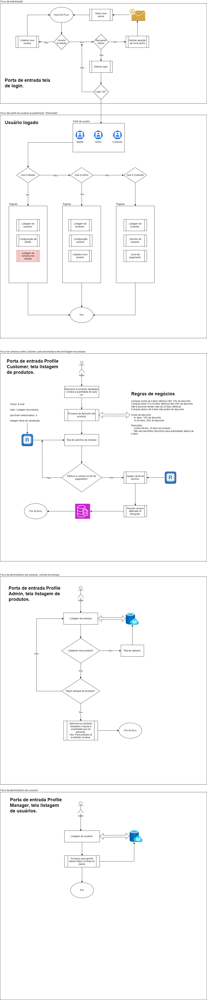

# Videos institucionais.
[▶ Explicação repo backend -> Assista ao vídeo no Google Drive](https://drive.google.com/file/d/15Hoy73Tm-T32hBovE8PT75Juh9zdjXCm/view?usp=drive_link)

[▶ Explicação projeto backend -> Assista ao vídeo no Google Drive](https://drive.google.com/file/d/13XT1uebFouq8YkJiM0yVp5IeRaUlD0Wv/view?usp=drive_link)

# Flow documents

# Provision API in docker with docker-compose

 	## Prerequisites
 * Install docker on your machine, follow the documentation: https://docs.docker.com/desktop/setup/install/windows-install/
 * Instale o docker-compose em sua maquina, segue a documentação: https://docs.docker.com/compose/install/
 
 * Navegue até a pasta onde está o docker-compose e faça o seguinte comando: docker-compose up -d
	* Obs: Images Postgress, Mongodb, Redis, API

 * If you prefer, you can run VS2022 to check the APIs.
 
	## Postman the collection in ./template/collection-postman
  
# Database.

  * Open "Package Manager Console" selected dll .ORM where is migrations and exc: Update-Database, then created tables and data table
  * Access portal with users:  
    <pre>
      Obs: TSC is my corporation
      User: manager@tsc.com
      pass: @Manager123
      profile: Manager

      User: admin@tsc.com
      pass: @Admin123
      profile: Admin

      User: customer@tsc.com
      pass: @Customer123
      profile: Customer   
    </pre>
   

  	
	
# Developer Evaluation Project /// Doc implementation

`READ CAREFULLY`

## Instructions
**The test below will have up to 7 calendar days to be delivered from the date of receipt of this manual.**

- The code must be versioned in a public Github repository and a link must be sent for evaluation once completed
- Upload this template to your repository and start working from it
- Read the instructions carefully and make sure all requirements are being addressed
- The repository must provide instructions on how to configure, execute and test the project
- Documentation and overall organization will also be taken into consideration

## Use Case
**You are a developer on the DeveloperStore team. Now we need to implement the API prototypes.**

As we work with `DDD`, to reference entities from other domains, we use the `External Identities` pattern with denormalization of entity descriptions.

Therefore, you will write an API (complete CRUD) that handles sales records. The API needs to be able to inform:

* Sale number
* Date when the sale was made
* Customer
* Total sale amount
* Branch where the sale was made
* Products
* Quantities
* Unit prices
* Discounts
* Total amount for each item
* Cancelled/Not Cancelled

It's not mandatory, but it would be a differential to build code for publishing events of:
* SaleCreated
* SaleModified
* SaleCancelled
* ItemCancelled

If you write the code, **it's not required** to actually publish to any Message Broker. You can log a message in the application log or however you find most convenient.

### Business Rules

* Purchases above 4 identical items have a 10% discount
* Purchases between 10 and 20 identical items have a 20% discount
* It's not possible to sell above 20 identical items
* Purchases below 4 items cannot have a discount

These business rules define quantity-based discounting tiers and limitations:

1. Discount Tiers:
   - 4+ items: 10% discount
   - 10-20 items: 20% discount

2. Restrictions:
   - Maximum limit: 20 items per product
   - No discounts allowed for quantities below 4 items

## Overview
This section provides a high-level overview of the project and the various skills and competencies it aims to assess for developer candidates. 

See [Overview](/.doc/overview.md)

## Tech Stack
This section lists the key technologies used in the project, including the backend, testing, frontend, and database components. 

See [Tech Stack](/.doc/tech-stack.md)

## Frameworks
This section outlines the frameworks and libraries that are leveraged in the project to enhance development productivity and maintainability. 

See [Frameworks](/.doc/frameworks.md)

<!-- 
## API Structure
This section includes links to the detailed documentation for the different API resources:
- [API General](./docs/general-api.md)
- [Products API](/.doc/products-api.md)
- [Carts API](/.doc/carts-api.md)
- [Users API](/.doc/users-api.md)
- [Auth API](/.doc/auth-api.md)
-->

## Project Structure
This section describes the overall structure and organization of the project files and directories. 

See [Project Structure](/.doc/project-structure.md)
